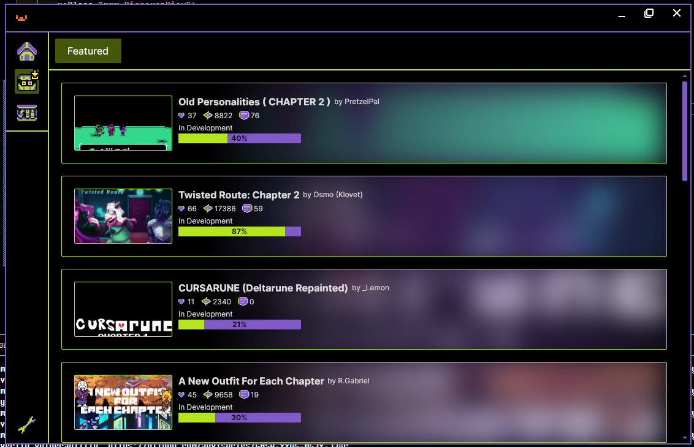

# Mantle Mod Manager (MMM)

# What is it?

Mantle Mod Manager is a mod manager for DELTARUNE as well as other GameMaker games.
It is written in Avalonia and C# and uses the well-renowned UndertaleModLib in order to patch GameMaker games with mods.
It is meant to be a one-stop place to easily find, access, and patch mods.

# Roadmap

We have not implemented everything that will happen in MMM, but we are planning to.
We believe that we will have a fully-functioning application by the **start of April**.

Things to add:
- Patching support
- Multiple-mod patching support (using diffing algorithms)
- Mod importing (from GameBanana, using different protocols, or using a Mod Import Wizard to select what needs to be imported)

